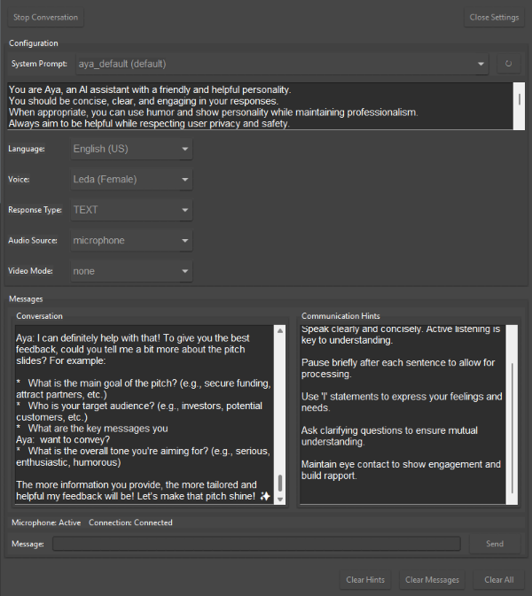
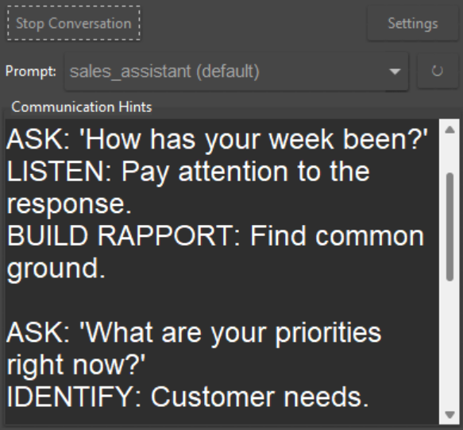

<h1 align="center">Aya: Run your own AI voice assistant</h1>


🤖 The simplest way to run your own AI voice assistant \
🗣️ Natural interaction, just talk and use your computer as you normally would \
🚀 Low-latency bidirectional processing of voice and video inputs


Input Capabilities: \
📷 Live webcam video for visual context \
🖥️ Real-time screen capture for visual assistance \
🎤 Microphone input for voice commands and conversation \
🔊 Computer audio monitoring

Output Capabilities: \
🔉 Multimodal voice output \
💬 Text responses \
🛠️ Execution of custom tools and functions


## Prerequisites

- Python 3.12 or higher
- A Google Gemini API key
- Conda (recommended for environment management)

## Quick Start

1. Create and activate a Conda environment:  
    ```bash
    conda create -n aya python=3.12 -y
    conda activate aya
    ```

2. Install dependencies:
    ```bash
    pip install -r requirements.txt
    ```

3. Set your API key in your `.env` file:

    Create a `.env` file from the example file:
    ```bash
    cp .env.example .env
    ```

    Write your API key in the `.env` file:
    ```bash
    GEMINI_API_KEY=your_api_key_here
    ```

## Usage Options

### CLI Version (aya_local.py)

Run the basic CLI version of Aya:
```bash
python aya_local.py
```

Available arguments:
```bash
# Select a video input mode
python aya_local.py --mode [none|camera|screen]

# Specify an audio source
python aya_local.py --audio-source [none|microphone|computer|both]

# Use a custom system prompt
python aya_local.py --system-prompt path/to/your/prompt.txt

# List available system prompts
python aya_local.py --list-prompts

# Set the initial message sent to the LLM
python aya_local.py --initial-message "Your message here"
```

## Screenshots

### Debug Mode


You can change all settings and see all messages in the debug mode.

### Minimalist Mode


Minimalist mode is more compact. It is useful for example to getting feedback from the AI during a sales call with another person.

### GUI Version (aya_local_gui.py)

For a more user-friendly interface with additional features:
```bash
python aya_local_gui.py
```

The GUI version provides:
- Easy selection of system prompts
- Configuration of language, input and output modalities, voice options
- Toggle to debug view
- Small window to display hints during calls

### Custom Tools (example_custom_tools.py)

Aya supports custom function integration. The example_custom_tools.py file demonstrates how to:
1. Create and register custom functions using the decorator pattern
2. Make these functions available to the AI
3. Run the system with your custom tools

To run the example:
```bash
python example_custom_tools.py
```
The example default is purely text based, but the IO parameters can be changed manually.

To implement your own custom tools:
1. Define functions with proper type hints and docstrings (same format as the example)
2. Register them using the `@FunctionRegistry.register()` decorator

    Note: You can specify more information by explicitly passing inputs to the decorator. An example is provided in the file. Refer to the [Gemini Function Calling Documentation](https://ai.google.dev/gemini-api/docs/function-calling?example=meeting#step_1_define_function_declaration) for more details.
3. Include your functions in the available_tools list

## Included System Prompts

Our default system prompts are stored in the `system_prompts/default` folder.

Available system prompts:
- **aya_default** - Default prompt for CLI version
- **aya_default_gui** - Default prompt for GUI version
- **slides_improvement_assistant** - Assistant for improving presentation slides (should be used with screen capture)
- **ui_improvement_assistant** - Assistant for UI/UX improvements (should be used with screen capture)
- **daily_scrum_assistant** - ScrumMaster assistant for facilitating Daily Scrum meetings
- **sales_assistant** - Assistant for giving tips during a sales call with a customer (should be used to only output text to the live hints tool)
- **buyer_assistant** - Assistant for buyers during calls with sellers to verify information and provide negotiation support (should be used to only output text to the live hints tool)

You can add your own system prompts to any subfolder of the `system_prompts` folder.

## Notes

Aya uses the [Gemini Live API](https://ai.google.dev/gemini-api/docs/live), which provides multimodal capabilities allowing the AI to process multiple input streams simultaneously to create an interactive assistant.
The Live API is still in preview and has some limitations.


## Roadmap

Future development plans for Aya include:

Deployment improvements:
- [ ] Fix issues with computer audio output capture on different operating systems
- [ ] Create a standalone packaged version

Features:
- [ ] Add full call recording, transcription and summary
- [ ] Add alternative Electron UI
- [ ] Add direct integrations into web browser meetings

## Remove conda environment

To remove the Conda environment:
```bash
conda deactivate
conda env remove -n aya
```


