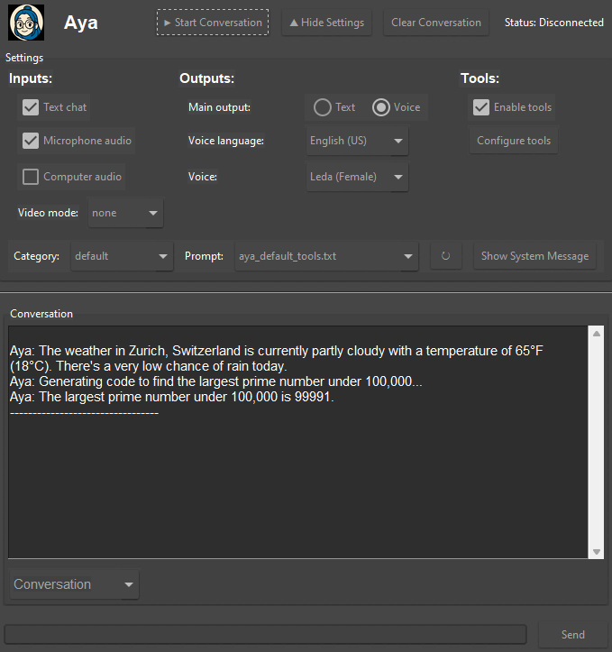

<picture>
  
</picture>

<h1 align="center">Aya: Run your own AI voice assistant</h1>


[](https://discord.gg/3KAmWKeyjR)
[](https://github.com/MiraiPitch/Aya/stargazers)

🤖 The simplest way to run your own AI voice assistant \
🗣️ Natural interaction, just talk and use your computer as you normally would \
🚀 Low-latency bidirectional processing of voice and video inputs

## Overview

Input Capabilities: \
📷 Live webcam video for visual context \
🖥️ Real-time screen capture for visual assistance \
🎤 Microphone input for voice commands and conversation \
🔊 Computer audio monitoring

Output Capabilities: \
🔉 Multimodal voice output \
💬 Text responses \
🛠️ Execution of custom tools and functions

Aya provides easy to use interface to configure settings, conversation history, and system messages.
You can configure input methods (text chat, microphone audio), output modalities (text, voice), and other settings through the UI.



## Quick Start

0. Prerequisites

    - A Google Gemini API key
    - Conda (recommended for environment management)

1. Create and activate a Conda environment:  

    ```bash
    conda create -n aya python=3.12 -y
    conda activate aya
    ```

2. Clone the repository and install the package:

    ```bash
    git clone https://github.com/MiraiPitch/Aya.git
    cd Aya
    pip install -e ./python
    ```

3. Set your API key in your `.env` file:

    Create a `.env` file from the example file:

    ```bash
    cp .env.example .env
    ```

    Write your API key in the `.env` file:

    ```bash
    GEMINI_API_KEY=your_api_key_here
    ```

## Usage Options

### CLI Version

Run the CLI version of Aya:

```bash
aya-cli
```

Available arguments:

```bash
# Select a video input mode
aya-cli --video-mode [none|camera|screen]

# Specify an audio source
aya-cli --audio-source [none|microphone|computer|both]

# Use a custom system prompt
aya-cli --system-prompt path/to/your/prompt.txt

# List available system prompts
aya-cli --list-prompts

# Set the voice for speech output
aya-cli --voice "Leda (Female)"

# Set the language for speech
aya-cli --language "English (US)"

# Set the response mode (AUDIO or TEXT)
aya-cli --response-mode AUDIO

# Set the initial message
aya-cli --initial-message "Hello! Can you tell me what the current date and time is?"
```

### GUI Version

For a more user-friendly interface with additional features:

```bash
aya-gui
```

The GUI version provides:

- Easy selection of system prompts
- Configuration of language, input and output modalities, voice options
- Toggle to debug view
- Small window to display hints during calls

### Custom Tools

Aya supports custom function integration. You can create example custom tools:

1. Create and register custom functions using the decorator pattern
2. Make these functions available to the AI
3. Run the system with your custom tools

You can run the included example:

```bash
python -m aya.examples.custom_tools
```

Or create your own custom tools based on the example.

### Test minimal example

If you are having issues with any of the versions above, you can try the minimal example to see if you have everything setup correctly.

```bash
python -m aya.examples.try_liveapi
```

## Included System Prompts

Our default system prompts are stored in the `python/src/aya/resources/system_prompts/default` folder.

Available system prompts:

- **aya_default** - Default prompt for Aya
- **aya_default_tools** - Default prompt for Aya with tool explanations
- **slides_improvement_assistant** - Assistant for improving presentation slides (should be used with screen capture)
- **ui_improvement_assistant** - Assistant for UI/UX improvements (should be used with screen capture)
- **daily_scrum_assistant** - ScrumMaster assistant for facilitating Daily Scrum meetings
- **sales_assistant** - Assistant for giving tips during a sales call with a customer (should be used to only output text to the live hints tool)
- **buyer_assistant** - Assistant for buyers during calls with sellers to verify information and provide negotiation support (should be used to only output text to the live hints tool)

You can add your own system prompts to any subfolder of the `python/src/aya/resources/system_prompts` folder. (even new subfolders)

## Notes

Aya uses the [Gemini Live API](https://ai.google.dev/gemini-api/docs/live), which provides multimodal capabilities allowing the AI to process multiple input streams simultaneously to create an interactive assistant.
The Live API is still in preview and has some limitations.

## Development

For development setup and contributing to Aya, see the [python/README.md](python/README.md) file.

## Remove conda environment

To remove the Conda environment:

```bash
conda deactivate
conda env remove -n aya
```

## Roadmap

Future development plans for Aya include:

Deployment improvements:

- [x] Create a standalone packaged version
- [ ] Alternative Tauri UI
- [ ] Fix issues with computer audio output capture on different operating systems
- [ ] Add to PyPI for easy installation

Features:

- [ ] Change settings in the middle of a call
- [ ] Separate GUIs/dashboards for different use cases
- [ ] Full call recording, transcription and summary
- [ ] Accessible memory based on conversations and documents
- [ ] Hightlight part of the screen as a reponse
- [ ] Access to files in a controlled environment
- [ ] Automatic creation of code to use APIs or tools

Integrations:

- [ ] Integration into web browser meetings
- [ ] Integration into Discord

## License

This project is licensed under the MIT License - see the [LICENSE](LICENSE) file for details.
